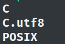
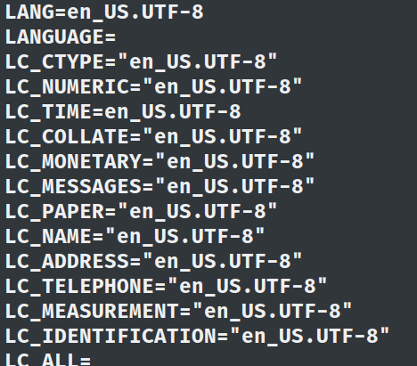

Say you're writing an API and you wanted to set your ```locale``` per region. You initialized everything in your python script but got an **error** saying ```unsupported locale setting```

Or maybe you know how to install a ```locale``` but you gotta do it in your pipeline script, and you're wandering if there's any ```cli``` alternative to ```dpkg-reconfigure locales```

#### Well, you're at the right place my friend.


To start off with the python thing, ```unsupported locale setting``` means that locale you're trying to use isn't installed.

To verify, say you wanna use, ```en_US.utf8``` in your code

Type in ```locale -a``` in your terminal

if you see something like this that means it's not installed.



To do so, type in,
```bash
echo "en_US.UTF-8 UTF-8" | sudo tee -a /etc/locale.gen
```
Now, install it by doing
```bash
sudo locale-gen en_US.utf8
```

And, you're done.

## One Liner

This **one-liner** is pretty useful and could also be used in pipelines.

```bash
echo "en_US.UTF-8 UTF-8" | sudo tee -a /etc/locale.gen; sudo locale-gen en_US.utf8
````

If you want to set that as your default ```locale``` do,

```bash 
sudo update-locale LANG=en_US.UTF-8
```
**You can also add other directives like ```LC_TIME```,```LC_ALL``` etc**

Exit from your shell and open a new terminal: verify by typing ```locale```

You'll see something like this,



If you think you wanna set a different ```locale``` as default repeat the process.

To manually set the default ```locale```,

Edit the file ```/etc/default/locale``` and append your desired directives like below,


### In your pipeline, do ```sudo locale-gen en_US.utf8``` if already setup or just use the [one-liner](#one-liner) to configure your ```locale``` without dpkg's Gui intervention

**Note:** 

		1. when doing manually make sure that your locale is installed and configured otherwise it might cause issues.
		2. LANG is the main thing you wanna set.
		3. It's important that you change your shell or signout or reboot for the default locale to reflect.
		4. In your pipeline script, if you're setting a said locale to default then execute other dependent programs or scripts in a new ssh directive.

