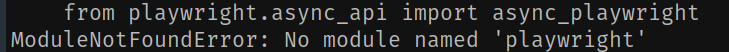
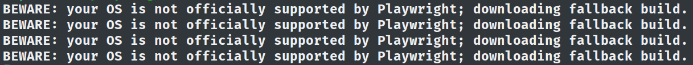
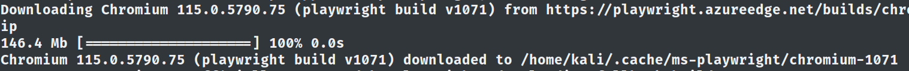
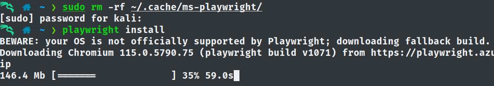

## Fix, BEWARE: your OS is not officially supported by Playwright(python edition)

So, you were working on a project using playwright; You were super happy to finally ditch selenium. Then one night you installed some packages using Apt. You see python3.11 is getting installed. Even better you thought in your mind..

Then after everything is done, you see pip has kind of removed all of your installed packages. In fact there's an entire thing going on. You googled it around, kind of got used to it; Pipx is great you were thinking..

The next day you opened your project, changed things a bit, ran the crawler and you see this,



You did the ovious, reinstalling playwright and then ```playwright install``` 

But now you get, 



A warning and the downloading didn't start that means, reinstalling playwright didn't sync up the playwright binary with the browsers it downloaded before.

Interesting..

Well I fiddled around with the error message for a while but chatgpt was too old for this and those github issues were depressing.


I look outside the window and then,

let's try something basic like nuking the folder where the browser binaries are stored..

But I didn't know what directory so I ran ```playwright install```
on a different machine. Well that was later, I sort of searched for playwright install articles hoping to get a snap of the install screen. maybe a better approach was to list out the directory paths containg `playwright` but anyways..


I see this,



Alright, so playwright stores the browser binaries within `~/.cache/ms-playwright`

let's nuke it,

```bash
sudo rm -rf ~/.cache/ms-playwright/
```

Then I ran ```playwright install``` again and it was working!




Later guys, till then keep smiling :)
